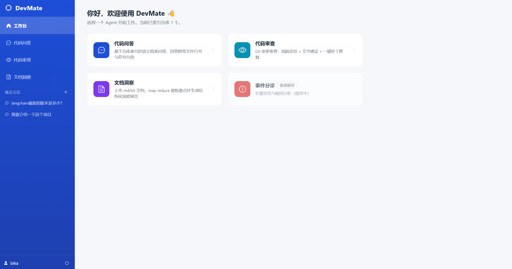
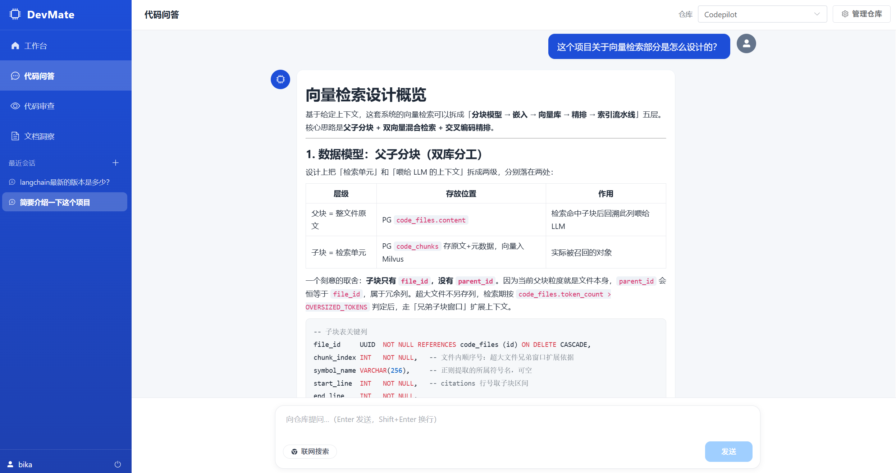
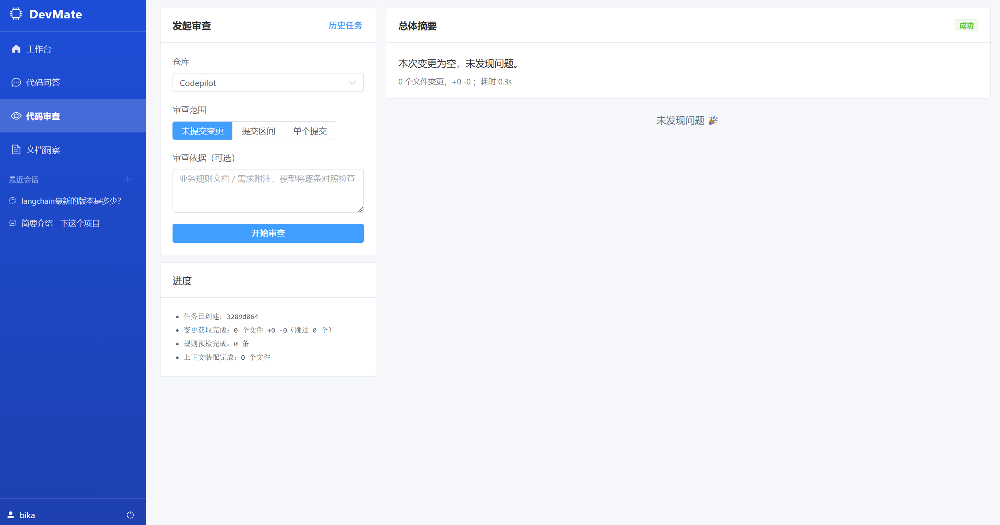
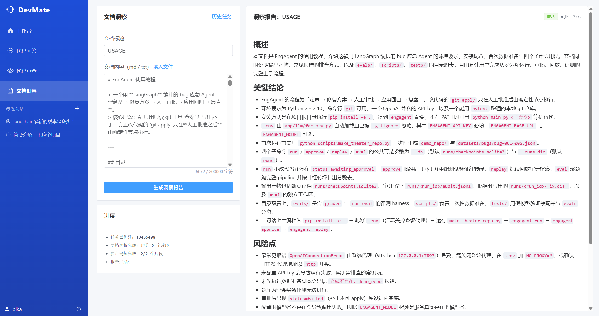

# DevMate · 多 Agent 代码助手 —— 使用说明

DevMate 是一个面向研发场景的多 Agent 助手，采用 **FastAPI + LangGraph** 后端与 **Vue3 + Element Plus** 前端分离架构，
以 PostgreSQL 作为业务库、Milvus 作为向量库，通过 DeepSeek 大模型 + 本地嵌入/精排/分类模型提供智能能力。

当前已上线三个 Agent：

| Agent | 能力 | 前端入口 |
| --- | --- | --- |
| **Code QA（代码问答）** | 基于仓库向量索引的 RAG 问答，支持多轮会话、引用溯源、可选联网搜索 | `/chat` |
| **Code Review（代码审查）** | 对未提交改动 / commit / 区间 diff 做审查，产出 findings，支持 HitL 一键应用补丁 | `/review` |
| **Doc Insight（文档洞察）** | 上传 md/txt 文档，map-reduce 提炼要点并生成结构化洞察报告 | `/doc-insight` |

---

## 界面展示

**工作台**：三个 Agent 卡片入口，一眼看清各能力定位。



**代码问答**：RAG 流式回答，带引用溯源与联网搜索开关。



**代码审查**：未提交变更 / 提交区间 / 单个提交三种模式，流式进度 + 总体摘要。



**文档洞察**：上传 md/txt 文档，map-reduce 流式生成结构化洞察报告。



---

## 一、系统架构

```
code-pilot/
├── main.py                 # 后端本地启动入口（必须用它启动，见「常见问题」）
├── requirements.txt        # 后端 Python 依赖（版本已锁定）
├── docker-compose.yml      # 基础设施：PostgreSQL / Milvus / etcd / MinIO / Attu
├── .env.local              # 全部配置项（数据库、模型、密钥等）——不入库
├── scripts/
│   └── init_db.sql         # 底座建表脚本（容器首次启动自动执行）
├── models/                 # 本地模型权重（离线，进程内加载）
│   ├── embedding/bge-m3            # 稠密+稀疏嵌入
│   ├── reranker/bge-reranker-large # 精排
│   └── classifier/all-MiniLM-L6-v2 # 意图分类
├── backend/
│   ├── main.py             # FastAPI 应用入口（lifespan：迁移→建图→挂路由）
│   ├── config.py           # 配置中心（读 .env.local）
│   ├── dependencies.py     # DB 会话 / 鉴权依赖 + Windows 事件循环守卫
│   ├── api/v1/             # 接口层：auth / code_qa / code_review / doc_insight / repos
│   ├── agents/             # 各 Agent：graph / state / prompts / schema / 专用逻辑
│   ├── core/               # llm_factory / logger / exceptions / retry / memory / knowledge_base
│   ├── db/migrations.py    # 幂等增量迁移（分布式 DDL 集中收集执行）
│   ├── services/           # orchestrator.py：SSE 编排、落库、降级
│   └── mcp/                # MCP server（knowledge_base / web_search）+ 统一客户端出口
└── frontend/               # Vue3 + Vite + TS + Element Plus + Pinia
    └── src/
        ├── api/            # http / sse / auth / codeQa / codeReview / docInsight / types
        ├── views/          # Login / Home / Chat / Review / DocInsight
        ├── components/     # ChatMessage / CitationCard / ConversationList / RepoManager
        ├── layouts/        # BasicLayout（侧边栏 + keep-alive）
        ├── router/         # 路由与登录守卫
        ├── stores/         # Pinia：auth / chat
        └── utils/markdown.ts
```

**数据流**：前端 → Vite 代理 `/api` → FastAPI（鉴权 + 校验）→ orchestrator 编排 → LangGraph 图（LLM / 检索 / MCP 工具）→ SSE 流式回推前端增量渲染。

---

## 二、环境要求

| 组件 | 版本要求 | 说明 |
| --- | --- | --- |
| Python | 3.11.x | 后端运行时（注意：3.11.0 有中文 traceback 缺陷，代码已规避） |
| Node.js | 18+（建议 22.x） | 前端构建 |
| Docker + Docker Compose | 最新稳定版 | 一键拉起 PG / Milvus 等基础设施 |
| DeepSeek API Key | 有效可用 | 所有 LLM 能力的必需项 |

**端口约定**（均与本机默认端口错开，避免冲突）：

| 服务 | 端口 |
| --- | --- |
| 后端 API | `8000` |
| 前端 Dev Server | `5173` |
| PostgreSQL | `5433`（容器内 5432） |
| Milvus | `19531`（容器内 19530） |
| Attu（Milvus 可视化） | `30000` |

---

## 三、快速开始

### 步骤 1 · 配置 `.env.local`

项目根目录下的 `.env.local` 是唯一配置源（已被 `.gitignore` 忽略，请勿提交真实密钥）。
必填项缺失会导致后端启动报错。参考模板：

```ini
# ===== 数据库（PostgreSQL）=====
DB_HOST=localhost
DB_PORT=5433
DB_NAME=copilot
DB_USER=copilot_user
DB_PASSWORD=<你的数据库密码>        # 必填

# ===== Milvus 向量库 =====
MILVUS_HOST=localhost
MILVUS_PORT=19531

# ===== DeepSeek 大模型 =====
DEEPSEEK_API_KEY=<你的 DeepSeek Key>  # 必填
DEEPSEEK_BASE_URL=https://api.deepseek.com
DEEPSEEK_MODEL_CHAT=deepseek-flash
DEEPSEEK_MODEL_CODER=deepseek-flash

# ===== 本地模型路径 =====
RERANKER_MODEL_PATH=./models/reranker/bge-reranker-large
CLASSIFIER_MODEL_PATH=./models/classifier/all-MiniLM-L6-v2
BGE_M3_MODEL_PATH=./models/embedding/bge-m3

# ===== JWT 认证 =====
JWT_SECRET_KEY=<随机长字符串>        # 必填
JWT_ALGORITHM=HS256
JWT_ACCESS_TOKEN_EXPIRE_MINUTES=10080

# ===== Web 搜索（博查，留空则联网搜索降级）=====
BOCHA_API_KEY=<可选>

# ===== 应用配置 =====
APP_ENV=local
APP_DEBUG=true
APP_HOST=0.0.0.0
APP_PORT=8000
LOG_LEVEL=INFO
```

> Docker Compose 复用同一份 `.env.local`（`DB_USER` / `DB_PASSWORD` 等），无需另配。

### 步骤 2 · 启动基础设施

```powershell
docker-compose --env-file .env.local up -d
```

- 首次启动会拉起 PostgreSQL、etcd、MinIO、Milvus、Attu。
- PostgreSQL 容器首次初始化时会自动执行 `scripts/init_db.sql`，建好 5 张底座表（users / repos / conversations / agent_runs / messages）。
- 用 `docker-compose ps` 确认各容器 `healthy` 后再继续（Milvus 依赖 etcd/MinIO 就绪，启动稍慢）。

### 步骤 3 · 安装后端依赖

```powershell
# 建议使用虚拟环境
python -m venv .venv
.\.venv\Scripts\Activate.ps1
pip install -r requirements.txt
```

> 依赖版本已在 `requirements.txt` 中锁定（如 `pymilvus==2.4.9`、`setuptools==80.9.0`、`FlagEmbedding==1.3.5`），请勿随意升级，否则会破坏兼容链。

### 步骤 4 · 启动后端

```powershell
python main.py
```

启动流程（`backend/main.py` 的 lifespan）：配置日志 → 执行幂等增量迁移 → 建立 PG checkpointer → 编译三个 Agent 图并挂到 `app.state`。
看到日志 `db.migrations_done` 与 `app.graphs_ready` 即启动成功。

- API 根地址：`http://localhost:8000`
- 健康检查：`http://localhost:8000/healthz`
- 交互式 API 文档（Swagger）：`http://localhost:8000/docs`

> ⚠️ **务必用 `python main.py` 启动，不要用 `python -m uvicorn backend.main:app`**。原因见文末「常见问题」。

### 步骤 5 · 启动前端

```powershell
cd frontend
npm install
npm run dev
```

- 打开 `http://localhost:5173`。
- 开发期 Vite 已把 `/api` 代理到 `http://127.0.0.1:8000`，前端直接请求 `/api/v1/...`，免 CORS。

---

## 四、功能使用说明

### 1. 登录 / 注册
- 首次使用在登录页注册账号（用户名 3–64 位，仅限字母/数字/下划线/短横线；密码 ≥6 位），**注册即登录**，自动签发 JWT（默认有效期 7 天）。
- Token 存于前端 Pinia auth store，后续请求自动带 `Authorization: Bearer <token>`。

### 2. 工作台（Home）
- 三个 Agent 卡片入口，点击进入对应功能页。

### 3. 代码问答（Chat）
1. 先在 **仓库管理** 中登记一个本地仓库（填写绝对路径），再触发 **索引**。索引为后台异步任务，列表页轮询 `index_status`：`pending → indexing → indexed`（失败为 `failed`）。
2. 只有 `indexed` 的仓库才能发起问答。
3. 选择仓库、输入问题即可流式获取答案，答案带 **引用溯源卡片**（文件 + 行号 + 符号）。
4. 可开启 **联网搜索** 开关（需配置 `BOCHA_API_KEY`），补充通用/时效信息，网页来源单独展示。
5. 支持多轮会话，历史会话在左侧列表可回放。

### 4. 代码审查（Review）
1. 选择仓库与审查模式：
   - `uncommitted`：审查工作区未提交改动；
   - `commit`：审查指定 commit（填 `head_ref`）；
   - `range`：审查区间（填 `base_ref` / `head_ref`）。
2. 可选填 **审查依据**（业务规则文档 + 附注），空则做通用审查。
3. 流式产出 findings（按严重度 critical/warning/info 排序），每条含文件、行号、类别、建议、可选补丁 diff。
4. **HitL 闭环**：对每条 finding 可「应用补丁」（自动 apply + commit，返回 commit hash；若与当前代码冲突返回 409 保持 pending）或「拒绝」。
5. 历史任务可在列表中回看详情。

### 5. 文档洞察（Doc Insight）
1. 填写文档标题，粘贴正文，或点「读入文件」上传 `.md` / `.markdown` / `.txt`（正文上限 20 万字符，超限前端拦截）。
2. 点击「生成报告」，后端走 **map-reduce** 三节点：
   - `ingest`：按段落边界分块（单块上限约 6000 字符，带 200 字符重叠防切断）；
   - `map`：并发（限流 5）逐块提炼要点；
   - `reduce`：要点归并（超 20 条分批）后流式生成结构化报告（`## 概述 / ## 关键结论 / ## 风险点 / ## 行动建议`）。
3. 报告逐 token 增量渲染，完成后可在历史抽屉回看旧任务。
4. 该 Agent 面向任意上传文档，**与仓库无关**，无需先登记仓库。

---

## 五、API 接口一览

所有业务接口前缀 `/api/v1`，除注册/登录外均需 Bearer Token。

### 认证 `/api/v1/auth`
| 方法 | 路径 | 说明 |
| --- | --- | --- |
| POST | `/auth/register` | 注册并返回 Token |
| POST | `/auth/login` | 登录返回 Token |
| GET | `/auth/me` | 校验 Token / 获取当前用户 |

### 仓库管理 `/api/v1/repos`
| 方法 | 路径 | 说明 |
| --- | --- | --- |
| GET | `/repos` | 当前用户仓库列表（含索引状态） |
| POST | `/repos` | 登记本地仓库（初始 `pending`） |
| POST | `/repos/{repo_id}/index` | 触发全量索引（后台异步） |

### 代码问答 `/api/v1/code-qa`
| 方法 | 路径 | 说明 |
| --- | --- | --- |
| POST | `/code-qa/chat` | SSE 流式问答（`meta → token* → done/error`） |
| GET | `/code-qa/conversations` | 会话列表 |
| GET | `/code-qa/conversations/{id}/messages` | 历史消息回放 |

### 代码审查 `/api/v1/code-review`
| 方法 | 路径 | 说明 |
| --- | --- | --- |
| POST | `/code-review/tasks` | SSE 流式审查（`meta → progress*/comment* → done/error`） |
| GET | `/code-review/tasks` | 审查任务列表（最近 50） |
| GET | `/code-review/tasks/{task_id}` | 任务详情 + 全量 findings |
| POST | `/code-review/findings/{finding_id}/apply` | HitL 应用补丁 |
| POST | `/code-review/findings/{finding_id}/reject` | HitL 拒绝建议 |

### 文档洞察 `/api/v1/doc-insight`
| 方法 | 路径 | 说明 |
| --- | --- | --- |
| POST | `/doc-insight/tasks` | SSE 流式洞察（`meta → progress* → token* → done/error`） |
| GET | `/doc-insight/tasks` | 洞察任务列表（最近 50，不含大字段） |
| GET | `/doc-insight/tasks/{task_id}` | 任务详情 + 完整报告与原文 |

**SSE 事件契约**：校验失败在流开始前以普通 HTTP 错误返回（400/409/422）；流开始后的失败统一走 `error` 事件。

---

## 六、大模型路由

`backend/core/llm_factory.py` 统一管理模型，按 Agent 类型路由（换模型只改路由表一行）：

| Agent 类型 | 模型 |
| --- | --- |
| `code_qa` / `code_review` | deepseek-coder（代码理解/审查/修复） |
| `doc_insight` / `incident_triage` / `summarize` / `route` | deepseek-chat（长文提炼/推理/短输出） |

- 默认 `temperature=0`（审查/修复/评分要稳定输出），模型层不重试，重试统一由 `core/retry.py` 负责。
- 通过自定义 httpx 客户端 `trust_env=False` 绕过系统代理，避免 Windows 代理导致 DeepSeek TLS 握手失败。

---

## 七、常见问题（FAQ）

**Q1：为什么必须用 `python main.py` 而不是 `python -m uvicorn`？**
Windows 下 psycopg 异步驱动不能使用默认的 `ProactorEventLoop`。`main.py` 会在导入 uvicorn / 应用之前先设置 `WindowsSelectorEventLoopPolicy`；而 `uvicorn` 命令是先创建事件循环再导入应用，守卫来不及生效，会报 `InterfaceError: ProactorEventLoop`。

**Q2：后端启动报数据库/Milvus 连接失败？**
先确认 `docker-compose ps` 各容器为 `healthy`，并核对 `.env.local` 的 `DB_*` / `MILVUS_*` 端口（5433 / 19531）与 compose 暴露的一致。

**Q3：问答页仓库无法选择 / 提示未索引？**
仓库需先「登记」再「触发索引」，等 `index_status` 变为 `indexed` 才能问答。索引失败（`failed`）看后端日志 `repos.index_failed`。

**Q4：所有 LLM 功能报失败 / 无输出？**
检查 `DEEPSEEK_API_KEY` 是否有效、额度是否充足。Key 无效时文档洞察会走「所有片段提炼均失败」的失败卡，代码问答/审查会走降级 error 事件。

**Q5：联网搜索开关无效果？**
需配置有效的 `BOCHA_API_KEY`；留空时联网搜索工具会报配置缺失并降级（不影响主问答）。

**Q6：端口被占用？**
本项目已把 PG 隔离到 5433、Milvus 隔离到 19531。若仍冲突，改 `.env.local` 与 `docker-compose.yml` 的端口映射，并同步前端代理目标。

**Q7：升级依赖后报错？**
`requirements.txt` 中多个版本是强约束（如 `setuptools==80.9.0` 提供 `pkg_resources`、`FlagEmbedding==1.3.5` 匹配 `transformers==4.51.0`、`bcrypt==4.0.1` 匹配 passlib）。请勿单独升级。

---

## 八、数据持久化

Docker 数据卷（`postgres_data` / `etcd_data` / `minio_data` / `milvus_data`）持久化，重启容器数据不丢。
彻底重置：`docker-compose down -v`（会删除所有数据卷，谨慎）。
